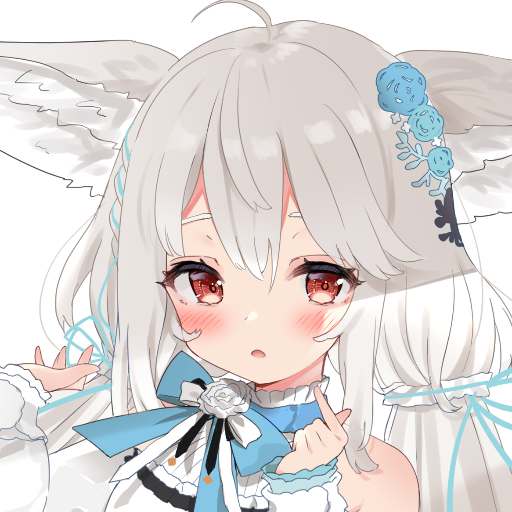

    
    <h1>
      <strong>Sakurada Shiro</strong>
    </h1>
    
    
    

Simple and colorful skins. With 60 FPS frame rate animations, you'll be able to play like a pro without a doubt.

## Data language

- [English](https://github.com/Maseshi/Sakurada-Shiro/blob/beta/documents/README.en.md)
- [日本](https://github.com/Maseshi/Sakurada-Shiro/blob/beta/documents/README.jp.md)
- [ไทย](https://github.com/Maseshi/Sakurada-Shiro/blob/beta/documents/README.th.md)

## All topics

- [Outstanding features](#outstanding-features)
- [Preview](#preview)
- [Limitation](#limitation)
- [Skin installation](#skin-installation)
  - [Normal installation](#normal-installation)
  - [Install by yourself](#install-by-yourself)
- [Credit](#credit)
- [Found a problem](#found-a-problem)
- [Google Translate](#google-translate)

## Outstanding features

- focus on simplicity It's easy on the eyes and looks colorful.
- Smooth animations at 60 FPS frame rate
- Emphasize white, black, blue as the main color of this skin.
- Nice clicking sounds will help you play better.
- Shiro will help you with each play.
- Support to use skins on [osu!lazer](https://github.com/ppy/osu/releases/latest)

## Preview

These previews were captured during testing periods and may differ from the skins in the current version.

    
These contents may contain spoilers. <strong>(click to continue)</strong>

    
    
    
    
    
    
    
    
    
    
    

## Limitation

Due to various reasons, we have these limitations. We sincerely apologize for these restrictions and these are the limitations of this skin.

- Skins are currently not supported in mania, catch, taiko modes, which will be rendered as default skins instead.
- Skins may not display properly for screens with resolutions greater than 1366x768.
- Skins are not yet supported for those who have [osu!supporter](https://osu.ppy.sh/home/support) full

If you have the ability and would like to help us get rid of these limitations. You can help us by [pull request](https://github.com/Maseshi/Sakurada-Shiro/pulls) from this repository or [support us](https://patreon.com/maseshi) to provide. This project can still go on.

## Skin installation

To install any skin pack You need to install osu! Before you can install this skin, please visit https://osu.ppy.sh/home/download. to install osu!

### Normal installation

1. Download the **Sakurada Shiro** skin pack from [this page](https://github.com/Maseshi/Sakurada-Shiro/releases/latest) by downloading the file named **Sakurada Shiro.osk**.
2. Once the download is complete Please open the **Sakurada Shiro.osk** file if you don't already have osu installed! This file cannot be opened or you can see how to install the skin manually from [here](#install-manually).
3. After you have opened the file, osu! The skins will be installed automatically for you and you can play them straight away without any settings. Well, have fun :)

### Install by yourself

1. Download the **Sakurada Shiro** skin pack from [this page](https://github.com/Maseshi/Sakurada-Shiro/releases/latest) by downloading the file named **Sakurada Shiro.zip**.
2. Once the download is complete, open the **Sakurada Shiro.zip** file and extract all files in the **Sakurada Shiro** folder.
   > **NOTE:** The extraction method differs for each operating system. You can find more details on how to extract the files from these links.
   > - [For the operating system MacOS](https://support.apple.com/guide/mac-help/zip-and-unzip-files-and-folders-on-mac-mchlp2528/mac)
   > - [For the operating system Windows](https://support.microsoft.com/en-us/windows/zip-and-unzip-files-f6dde0a7-0fec-8294-e1d3-703ed85e7ebc)
3. Once the extraction is complete, move the **Sakurada Shiro** folder to the osu game file directory! Yours, which will look like `C:\Program Files\osu!\Skins\`
4. After moving the files Now you will need to enter osu! to select a skin to use. When entering the game, press **Options**, then type **Skins**, an option will appear named **"Skin"** along with other options. If the default option is **Defualt**, select the skin named **Sakurada Shiro**.
5. Run a test by playing once or clicking Preview **(Preview gameplay)** to see if the game has changed the skin. If not, you may need to start the installation again.

## Credit

within such skins We are not all of them and below are the sources of all references and the names of the authors of the work. Thank you in advance for these great works.

- menu-background\
  Artwork: 水々\
  Original: https://www.pixiv.net/en/artworks/89164923

- section-pass\
  Artwork: rulu＠お仕事募集中\
  Original: https://www.pixiv.net/en/artworks/89840657

- section-fail\
  Artwork: きらまるこう\
  Original: https://www.pixiv.net/en/artworks/95020949

- go\
  Artwork: あみみ\
  Original: https://www.pixiv.net/en/artworks/90559521

- fail-background\
  Artwork: ここね\
  Original: https://www.pixiv.net/en/artworks/89025605

- pause-overlay\
  Artwork: やみや\
  Original: https://www.pixiv.net/en/artworks/92097252

- comboburst\
  Artwork: 寝頃日るかこ\
  Original: https://www.pixiv.net/en/artworks/89670715

- selection-mode & icon\
  Artwork: 赤城あんこ\
  Original: https://www.pixiv.net/en/artworks/88676872

For other credits, please visit [CREDITS.md](https://github.com/Maseshi/Sakurada-Shiro/blob/beta/CREDITS.md).

## Found a problem

If you encounter any problems from current use You can let us know through the tab. [issue](https://github.com/Maseshi/Shioru/issues) of this repository.

## Google Translate

The content of this document has been translated by the [Google Translate](https://translate.google.com/) service. We apologize for any errors.
